Data compression is an essential tool to provide efficient communication between satellites and ground stations.
When used in lossless regime, original data can be reconstructed with perfect fidelity. However, this is typically at the cost of reduced compression ratios, i.e., relatively large compressed data volumes.
On the other hand, lossy data compression allows producing significantly smaller data volumes, at the cost of introducing some distortion between the reconstructed and original samples.

One important goal of the IQ toolbox is to be able to assess the impact of lossy compression from the perspective of  the different analysis tasks for which the images are captured. Leveraging this information, compression performance can be optimized without compromising the scientific nor commercial value of the reconstructed data. 
To achieve this goal, a fully functional codec suited for space use is developed as a part of the IQ toolbox. This codec provides both lossless and lossy compression regimes. More specifically, near-lossless compression with user-defined maximum absolute error is available.

To maximize the relevance of any analysis performed using this codec, the compression and decompression algorithms have been tailored to the general case of Earth Observation, aiming to jointly improve data compression and computational complexity results. The remainder of this page provides details on the design decisions and relevant metrics considered during the development of the aforementioned codec.

This document and the compression system were developed by the Universitat Autònoma de Barcelona as a part of the Retos Colaboración RTC2019-007434-7 project.

[[_TOC_]]

# Review of the State of the Art

A full review of the state of the art has been conducted to stablish the best type of compression/decompression pipeline as well as the baseline algorithms for comparison. A detailed summary of this review is available in [this technical report](img/progress_report_202103.pdf). Instead of duplicating contents therein included, only a summary of the most relevant outcomes is described next.

An introduction to satellite constellations from the general perspective of the project is provided first. The need for data compression, and further discussion on lossless versus lossy data compression is also available. The most relevant data compression methods suitable for satellite constellations are compared next.

Experimental have been used to assess the compression performance and complexity trade-offs of each algorithm. Analysis of these results suggests that the family of variable-to-fixed (V2F) codes are the most suitable to provide more beneficial trade-offs that other methods in the state of the art. Note that a quantitative and qualitative description of the test dataset is also available in the technical report.

# Compression pipeline design

The first and more general design decision is the pipeline structure of the codec. Due to the constraint asymmetry between the compressor and the decompressor, this structure is determined entirely by the compressor side of the algorithm. 

Based on the review of the state of the art, high-throughput entropy coding is applied after a decorrelation stage. The two main parts of decorrelation are quantization (which introduces distortion except for uniform quantization of step size 1), and prediction. The resulting pipeline is depicted in the following picture. The remainder of this section decribes other results and design decisions specific to each of the pipeline stages.

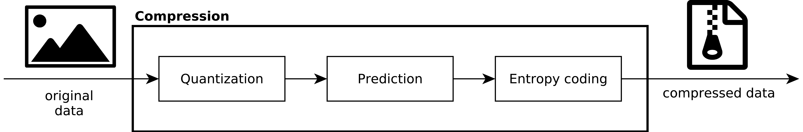

## Quantization

Three main aspects need to be determined regarding the quantization stage. Its order respect to the prediction stage, the type of quantization performed, and the quantization steps to be used. Design decisions on these aspects are justified next.

### Order of quantization and prediction

<!-- It is well known that applying quantization before prediction typically incurs in a compression performance penalty, as compared to applying quantization after prediction. Notwithstanding, this approach requires the compressor to also apply the decoder's side of the pipeline, in order for both to performed identical predictions.  -->

This entails a complexity increment at the encoder side, specially for software-based implementations. Furthermore, compression performance differences are often small, specially at high bitrates close to lossless regimes. Taking all this into account, applying quantization after prediction is discarded in favor of quantization followed by prediction.

### Quantization types

Two important aspects of quantization with direct impact on compression performance and computational complexity are (a) the number of symbols that are quantized together; and (b) the size of each quantization bin, both relative to the dynamic range of the data, and to other quantization bins.

When one symbol is quantized at a time, it is typically referred to as scalar quantization. For the proposed compressor, scalar quantization is used due to is very low complexity, and its competitive compression performance compared to non-scalar methods in the literature. It should be highlighted that this decision is consistent with those made for the most successful codecs analyzed in the state of the art.

The size of each quantization bin determines the maximum error introduced for pixels that fall into that bin, and contributes to the final compressed bit rate. It is well known that, even though optimal quantizers typically have bins of different sizes, using uniformly sized bins often yields similar rate-distortion results except at medium and high maximum pixel errors. Based on this, and also to allow for less complex implementations, uniform scalar quantization is considered hereafter.

## Prediction

The prediction stage produces educated guesses for each sample value based on previously seen samples. Prediction errors (also known as prediction residuals) are then passed to the entropy codec after mapping zero, negative and positive integers to non-negative, integer values. 

When prediction uses only samples pertaining to the image being currently compressed, it is usually referred to as intra prediction. When other images or frames are employed, it is often called inter prediction. For this project, both intra and inter prediction will be considered. At this stage, only inter methods have been studied. These are typically employed in low-complexity compression scenarios, and provide a baseline for comparison. In later stages of the project, intra prediction will be added to the analysis and potentially to the developed codec prototype.

### Intra prediction

Intra prediction uses only previously seen samples from the image being compressed. Furthermore, to reduce the buffer requirements and compression delay, and to maximize the available redundancy to be exploited, only neighboring samples are considered. In the following table, **X** refers to the sample being predicted, and letters **A**-**J** are neighboring samples.

<br/>

| . | . | . | .  |
| --- | --- | --- | --- |
| **A**   | **B**   | **C**   | **D**   |
| **E**   | **F**   | **G**   | **H**   |
| **I**   | **J**   |**X**|     |

<br/>

In the following figure, the entropy distribution of the residuals for different prediction methods is shown. Here, **N**, **W** and **NW** are employed as an aliases for **G**, **J** and **F**, respectively. In the figure, the average entropy for the complete test dataset is depicted with a dot. 
It should be highlighted that when more than one pixel is considered, their average value is computed for the prediction.

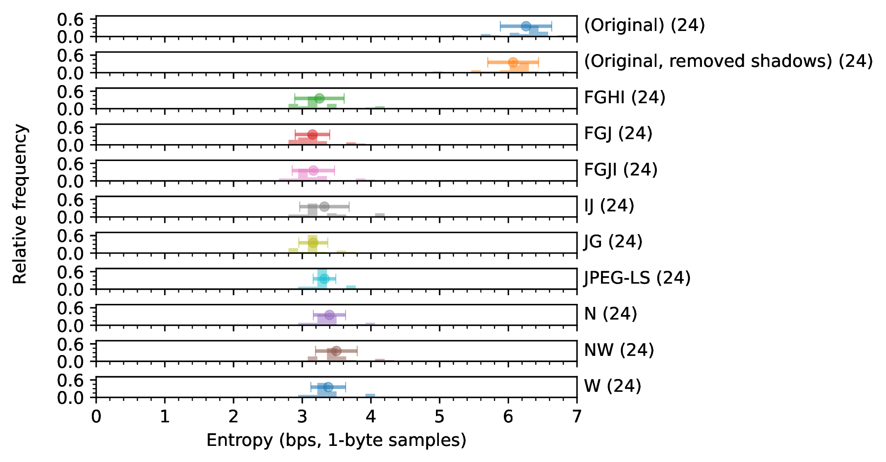

Several observations can be made based on the obtained results:

- Intra prediction using neighboring pixels is highly accurate and significantly reduces output entropy.

- Using 1 or 2 neighbors typically yields results close to those of more complex predictors that use more neighbors.

- Edge detection and high-frequency detection is not more efficient than exploiting only the low-frequency redundancy.

Based on these observations, the **W** and **JG** yield the best complexity-entropy trade-off for this scenario, and have been included in the codec prototype. As mentioned above, these will be used as baseline for comparison with further prediction methods yet to be researched during this project.

### Same-frame prediction experiment

In this experiment, images are shifted a number of pixels in the X and Y axes, and the resulting data (after padding) is used to predict the image. In the following figures, the entropy of the prediction residuals and their MSE is shown for different shift values in the X, Y and X+Y directions. 

#### With shadows

In this experiments, images are considered directly without pay attention to the shadowed areas.


As can be observed, both the entropy and the MSE increase monotonically as a function of the distance. Furthermore, the observed entropy results for displacement of 1 pixel in the X axis match those of the West prediction, included in the prototype. It should be noted that there is a preference for the X axes in terms of prediction accuracy (even when euclidean distance is considered). 

The main hypothesis is that this can be caused by the horizontal shadow regions, which are best predicted when the Y offset is 0 (horizontal prediction). Further tests will assess whether images without shadow regions exhibit similar properties.


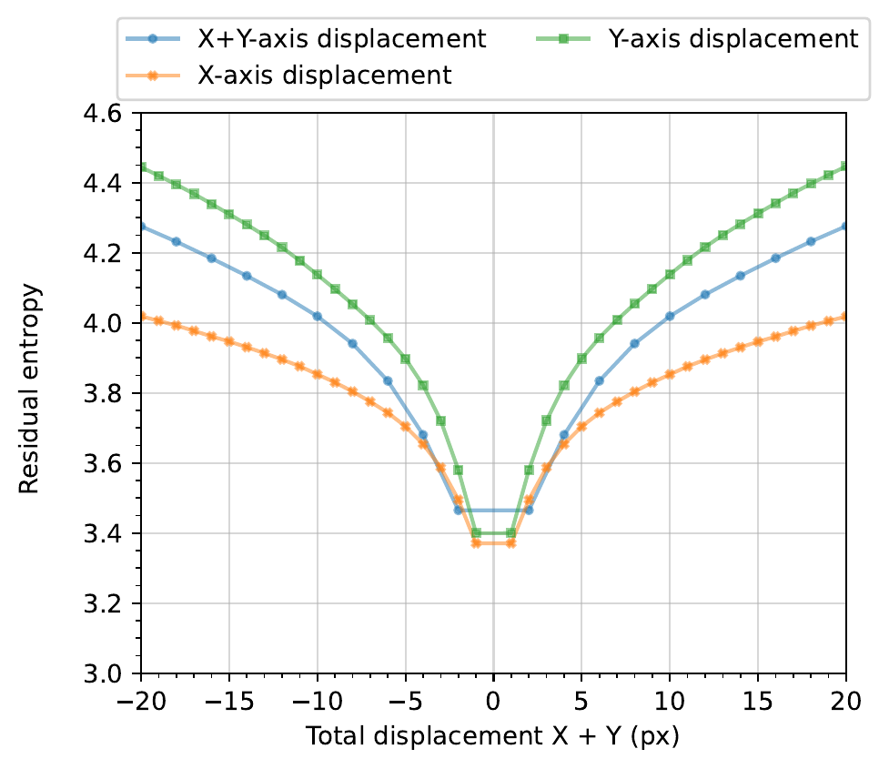

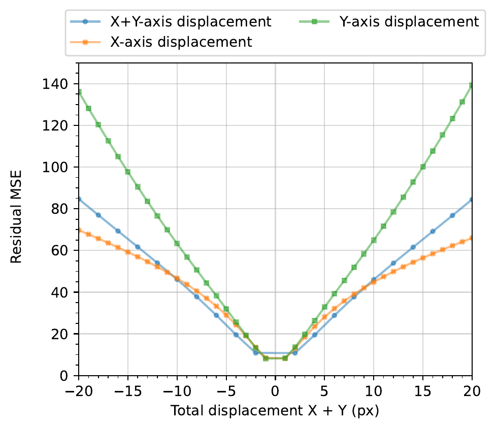

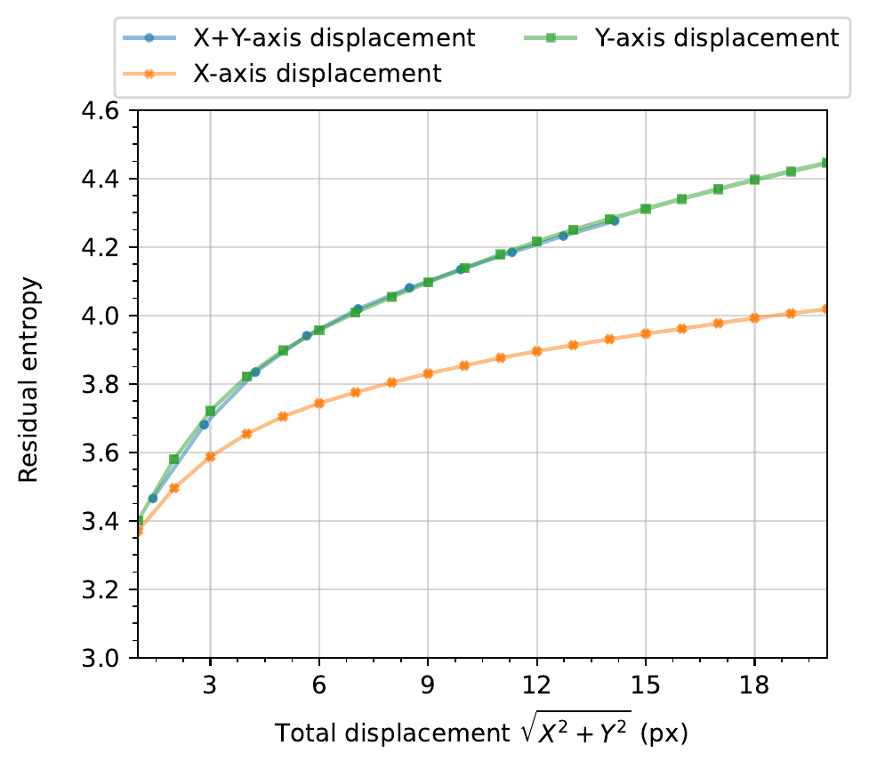


## Entropy coding

The entropy coding stage transforms input samples (in this case, prediction residuals) into a compact representation. Among the many existing types of entropy coders, the focus was set on those of low complexity. Therefore, range coders such as arithmetic coders and adaptive methods with complex contexts remain out of the scope of this project.

Among the remaining methods, variable-to-fixed (V2F) codes were highlighted in the review of the state of the art. These methods work by defining a coding tree adapted to the input probability distribution. For instance, the following figure displays a toy example of V2F code for an alphabet of 4 symbols (0, 1, 2 and 3), respectively with probabilities 0.593, 0.253, 0.108, and 0.046. 

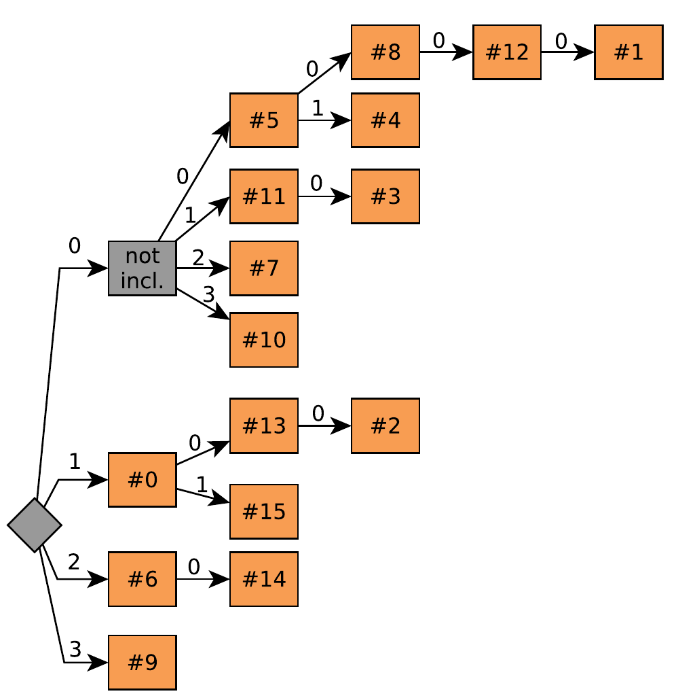

When coding, one starts at the root of the tree and advances through edges corresponding to the next input symbol. When no such edge exists (e.g., for leafs), the fixed-width word is emitted and one returns to the root node.

Some of the main advantages of V2F, decisive for using them in this project are as follows:

- These methods transform multiple input samples into a single output word of fixed length. This enables high compression efficiency can be obtained with reasonably sized dictionaries. 

- Codes can be easily tailored for any input distribution. This feature helps V2F codes be competitive and sometimes superior to other entropy coding methods in the literature.

- Producing compressed codewords of fixed length allows very fast software implementations, in particular when that length is an integer number of bytes. This feature has a particularly positive impact on the complexity-compression trade-offs.

# V2F compression prototype

Based on the review of the state of the art and a number of experiments using data from real missions, a C99 implementation of a V2F codec has been developed. This implementation accepts arbitrarily constructed (valid) code forests. To analyze the test corpora and produce optimized code forests, a set of python scripts are provided. These are the ones employed to generate the distributed code forests, and can be used for new data samples if desired. Finally, a set of python scripts to analyze the prototype's performance have been produced. A diagram of prototype and the aforementioned tools is presented next:

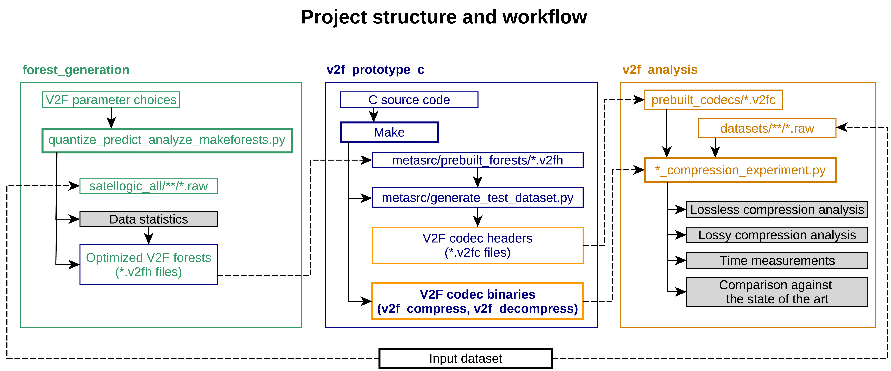

## Prototype design decisions

### Prediction stage

The following predictors are currently implemented in the V2F prototype due to their low complexity. They are provided in increasing entropy results:

* West "W" predictor
```math 
\hat{s}_{x,y} = s_{x-1,y}
```
* Two west "(W1+W2)/2" predictor
```math 
\hat{s}_{x,y} = \lfloor (s_{x-1,y} + s_{x-2,y} + 1) / 2 \rfloor
```
* JPEG-LS (uses a combination of positions F, G, H and J using the notation of the figure above.

In addition to these prediction methods, prediction based on past reference frames is currently being studied.

### Entropy coding stage

Variable to Fixed codes are used as the main component of the entropy coding stage. These codes are built as a set of code tress, also known as code forests. Code trees are optimized for specific symbol distributions, that are calculated experimentally. The statistics for which data are computed are those produced by the prediction stage. Therefore, different optimizations need to be performed for each prediction method.

The number of trees in a forests has an impact on both the compression efficiency (more trees, better efficiency) and the compression time (more trees, slower execution time). Notwithstanding, the number of included nodes in each code tree is fixed to 65536, as this provides the best efficiency for 2-byte output word length. Using either non-byte lengths, or different from 2 results in considerable execution performance penalties.

To maximize the efficiency of the allowed number of included nodes, an outlier handling method is studied. The approach consists in splitting the input symbols into two groups: probable and outlier. Probable symbols are compressed using optimized V2F codes. Outlier symbols can be coded raw with small performance penalties. Given the good performance of the prediction stages, it is possible to keep the 4-16 most probable symbols as probable. This allows the creation of deeper coding trees with the fixed amount of 65536 nodes, which translates into more input symbols being encoded in each output word of 2 bytes, thus enhancing performance.

### Performance figures

The most recent performance results are shown next. In addition to the V2F prototype, CCSDS 123.0-B-2, JPEG-LS and JPEG 2000 are included in the comparison. For the V2F prototype, results for all available prediction methods and different tree sizes are shown as well.

#### Lossless compression results

In the following figure, the lossless compression bit rate in bit per sample is displayed.

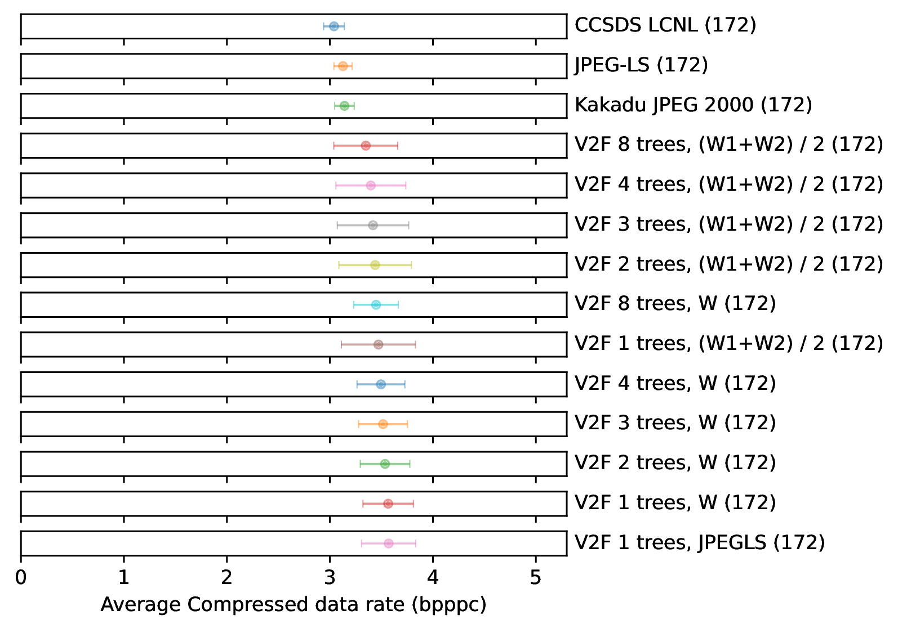

The corresponding compression time of the same set of algorithms.

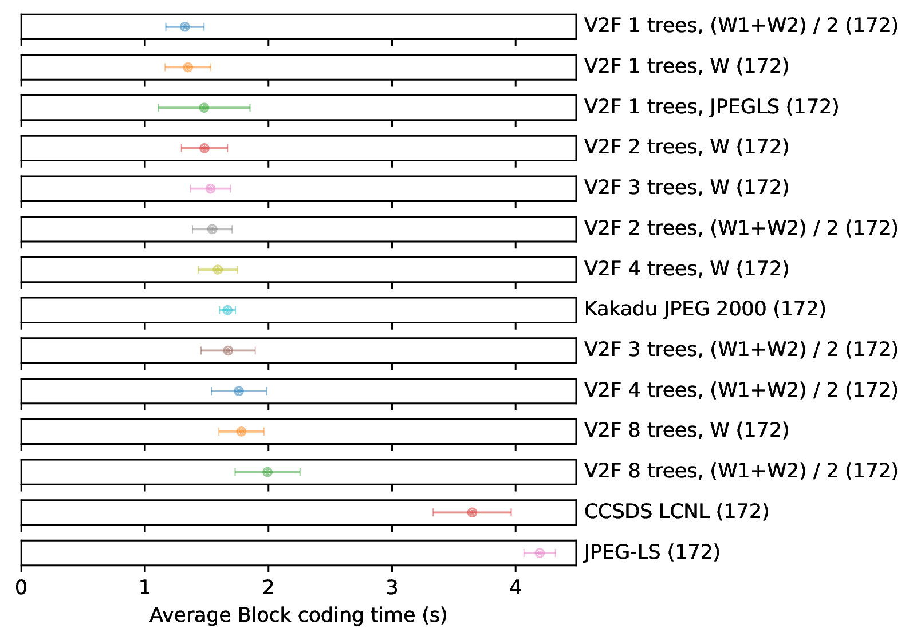


#### Lossy compression results

In this experiment, the lossless and near-lossless capabilities of the different codecs are evaluated. 

The V2F codecs are used for different quantization steps. A V2F forest is optimized for the resulting distributions after each quantization step. Forests with one tree are evaluated here, although there are forests available with 4 and 8 forests as well. 

The JPEG-LS and CCSDS 123.0-B-2 standards are executed by selecting the maximum absolute error instead of the quantization step size. Errors of 1 through 5 are evaluated.

The JPEG 2000 algorithm is evaluated at several fixed target bitrates between 1 and 5 bits per sample.

In the following figure, the PSNR of the reconstructed images is shown as a function of the compressed data bitrate. Each marker in a line corresponds to a single quantization step or maximum error selection.

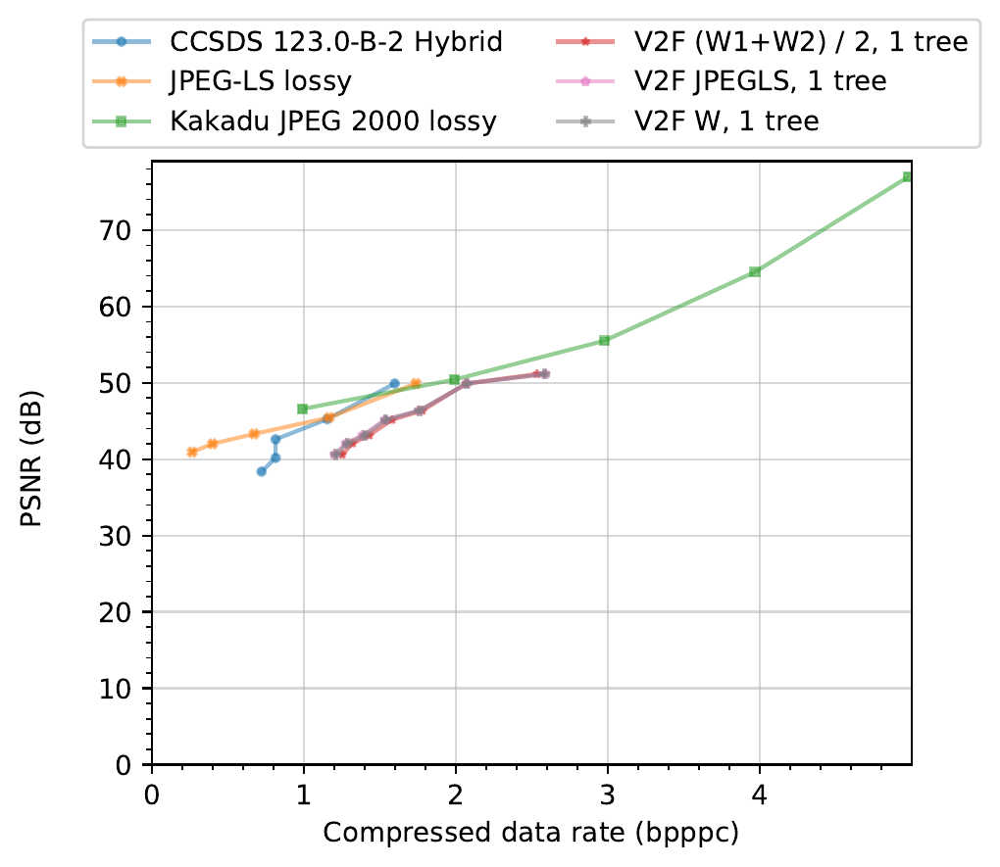

In the next figure, the peak absolute error (PAE) of each codec is evaluated against the compressed data bitrate. 

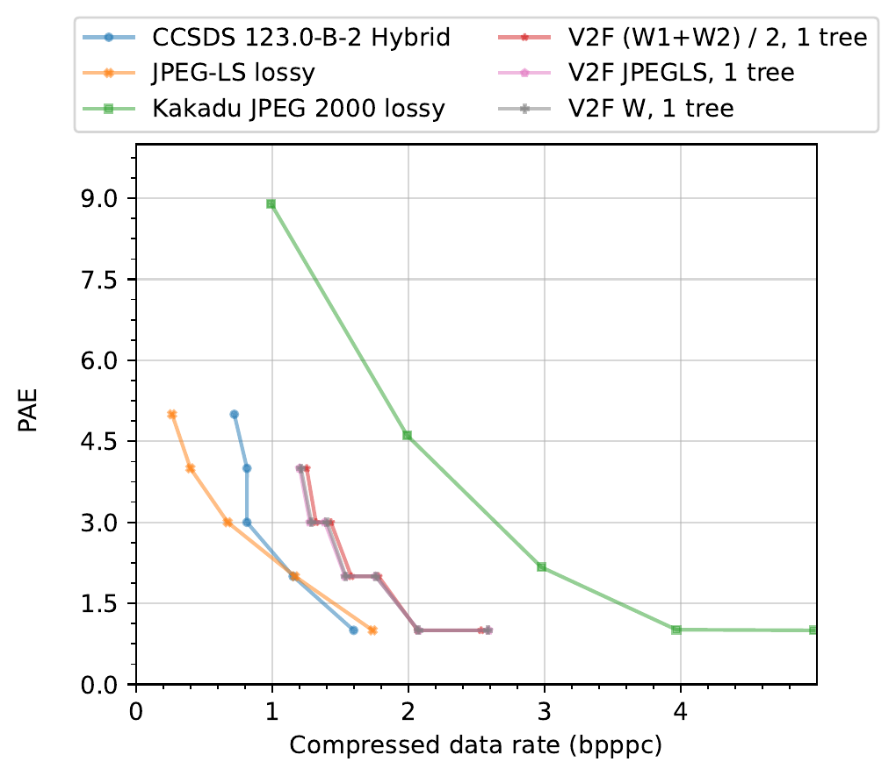

#### Visual reconstruction quality

To provide better context to the previous results, a selection of image crops reconstructed after different quantization steps is shown next:

**128x128 crops of image_20200516-074719-603_0057**

Qsteps 1 to 4:

 


Qsteps 5 to 8:


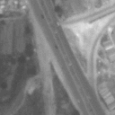


**128x128 crops of 20201008-135326-081_0143**

Qsteps 1 to 4:


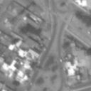


Qsteps 5 to 8:


**128x128 crops of image_20201008-135326-461_0149**

Qsteps 1 to 4:


Qsteps 5 to 8:

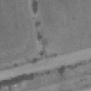


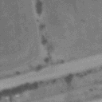
